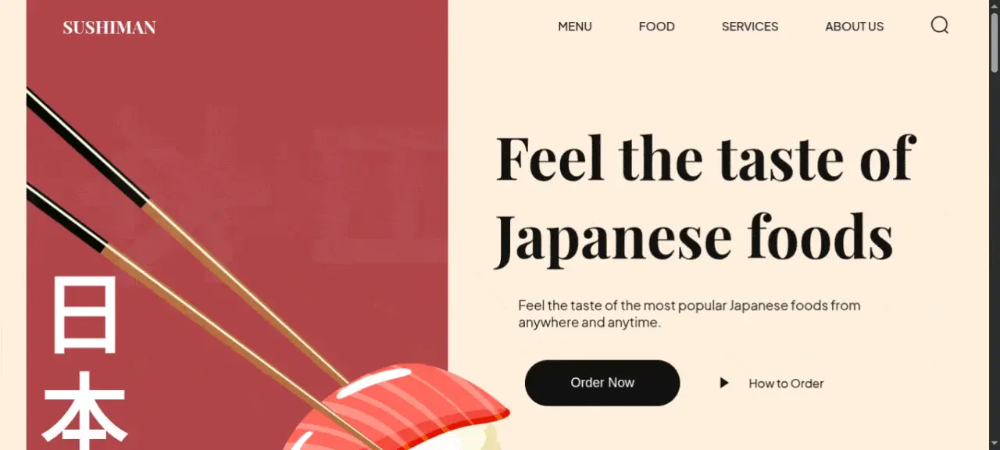

# Sushiman 🍣

A modern, elegant, and fully responsive landing page for a Japanese sushi restaurant. This project focuses on high-quality UI/UX with smooth sections dedicated to popular foods, trending sushi, drinks, and a newsletter subscription.



## 📋 Table of Contents

- [Sushiman 🍣](#sushiman-)
  - [📋 Table of Contents](#-table-of-contents)
  - [✨ Features](#-features)
  - [🛠 Tech Stack](#-tech-stack)
  - [📁 Project Structure](#-project-structure)
  - [🚀 Getting Started](#-getting-started)
    - [Prerequisites](#prerequisites)
    - [Installation](#installation)
  - [⚙️ Available Scripts](#️-available-scripts)
  - [📄 License](#-license)

## ✨ Features

- **Modern UI/UX**: Clean, minimalist design tailored for Japanese aesthetics.
- **Fully Responsive**: seamless experience across mobile, tablet, and desktop devices.
- **Modular Architecture**: CSS is split into component-based files (Hero, About, Popular, Trending, etc.) for maintainability.
- **Optimized Tooling**: Built on top of Vite for rapid development and optimized production builds.

## 🛠 Tech Stack

- **HTML5** (Semantic structure)
- **CSS3** (Custom properties/variables, Flexbox, Grid)
- **Vanilla JavaScript** (ES6+)
- **[Vite](https://vitejs.dev/)** (Next Generation Frontend Tooling)

## 📁 Project Structure

```text
├── public/                 # Static assets
├── src/
│   ├── assets/             # Images, icons, and illustrations
│   ├── styles/             # Modular CSS structure
│   │   ├── sections/       # Feature-specific styles (about, footer, etc.)
│   │   └── style.css       # Global styles and variables
│   └── main.js             # Entry point for JavaScript
├── index.html              # Main HTML document
├── vite.config.js          # Vite configuration
└── package.json            # Project dependencies and scripts
```

## 🚀 Getting Started

Follow these instructions to get a local copy of the project up and running.

### Prerequisites

Make sure you have [Node.js](https://nodejs.org/) installed along with a package manager like `npm`, `yarn`, `pnpm`, or `bun`.

### Installation

1. **Clone the repository:**

   ```bash
   git clone https://github.com/hichamweblog/sushiman.git
   ```

2. **Navigate into the project directory:**

   ```bash
   cd sushiman
   ```

3. **Install the dependencies:**
   ```bash
   npm install
   ```

## ⚙️ Available Scripts

In the project directory, you can run the following tasks:

- **`npm run dev`**: Starts the Vite development server with Hot Module Replacement (HMR).
- **`npm run build`**: Packages the app for production into the `dist` folder.
- **`npm run preview`**: Boots up a local static web server to preview your production build.

## 📄 License

This project is open-source and available under the terms of the `LICENCE` file included in this repository.
